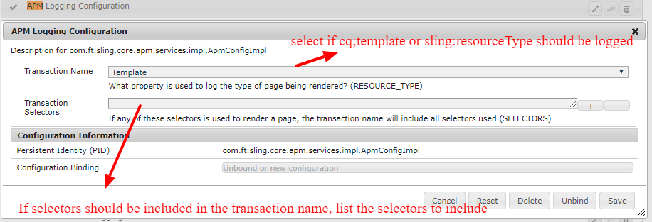

# Sling APM Framework

**The Sling APM Framework version 1.0.0 supports New Relic and Elastic APM vendors.**  

The Sling APM Framework is a collection of OSGi filters and services that allow you to easily group and analyze AEM pageviews within application performance metric software.

When APM software is used to monitor sling out of the box, all of your web transactions are logged as the same name, which provides little value.  The Sling APM framework allows you to instead rename your web transactions to use the sling:resourceType or cq:template of a page.

This allows you to easily look for performance bottlenecks for specific resource types or templates to more easily pinpoint ill performant code. 

In addition to viewing the response time of each type of page being rendered, the Sling APM framework will also log to your APM provider anytime a component is included in the page.

This allows you to not only view the response time of a given type of page, but also allows you to drill down into the individual components that make up the page, so you can easily identify individual components causing bottlenecks.

If you are using another APM provider, it can easily be implemented using the `ApmAgent` interface and will automatically start logging transaction data.  Please submit a pull request if you add your own provider so others can use it!

## How To Configure

To use the Sling APM Framework, you can add it directly to AEM, or include it as part of your project.
 
 To add to your project, first add it's dependency to your POM file:

```
<dependency>
 <groupId>com.freedtechnologies</groupId>
 <artifactId>sling-apm.ui.apps</artifactId>
 <version>1.0.0</version>
</dependency>
```

Next, embed the Sling APM package dependency in your deployable content package:

```
 <plugin>
    <groupId>com.day.jcr.vault</groupId>
    <artifactId>content-package-maven-plugin</artifactId>
    <executions>
      <execution>
        <goals>
          <goal>package</goal>
        </goals>
        <configuration>
          <subPackages>
            <subPackage>
              <groupId>com.freedtechnologies</groupId>
              <artifactId>sling-apm.ui.apps</artifactId>
              <filter>true</filter>
            </subPackage>
             </subPackages>
        </configuration>
      </execution>
    </executions>
  </plugin>
```

Or, download the Sling APM Framework package and install it into your AEM instances.

To enable the Sling APM Framework in general, include OSGi configuration in the package you deploy, or manually set the following configurations in Felix:

### Enabling APM In General

To enable custom transaction names in your APM monitoring, select if the sling:resourceType of cq:template should be used as the transaction name:



Another option that can be configured is selectors that should be used in a transaction name.  For example, if I have a page: apm.html, and provide an alternative rendering of the page using apm.myselector.html, if you add "myselector" to the configuration, your APM software will output one transaction name for the page being rendered without that selector, and another transaction name that includes "myselector" for pages that were rendered with the selector.  This allows you to have seperate transaction names based on the selectors used to render a page.

Once you've enabled the general options for APM logging, configure it for the APM vendor you use.  Version 1.0.0 supports New Relic and Elastic APM.

### Enabling APM For New Relic

To enable APM for new relic, simply check the "enabled" box for it's OSGi configuration:


### Enabling APM For Elastic APM

To enable APM for Elastic APM,  check the "enabled" box for it's OSGi configuration:


If you would like to view timing details of componenents rendered within the page (this provides great information and is something you likely want to enable), also check the "log components" checkbox.

Once you've configured the Sling APM Framework, your APM vendor should automatically start logging your new transaction names.

